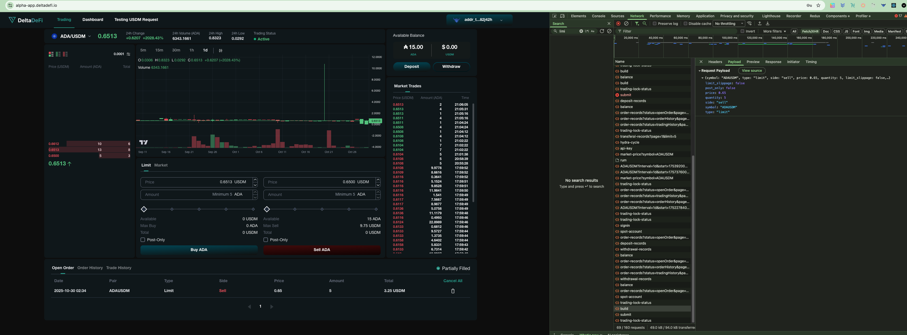

# Frontend & Backend Integration Process and Functionalities Testing

<strong>Sign in to Account</strong>

After the user has pressed the connect wallet button and signed the wallet ownership verification message, frontend will send a signin request to backend using the `SignIn` API

### POST - SignIn (Status Code)

<figure><figcaption></figcaption></figure>

The `200 status code` shows the api is being called and responded successfully

### POST - SignIn (Request params)

<figure><figcaption></figcaption></figure>

The request param is aligned with the required request param from the backend API

<figure><figcaption></figcaption></figure>

### POST - SignIn (Response)

<figure><figcaption></figcaption></figure>

The response fields are aligned with the required response fields from the backend API

<figure><figcaption></figcaption></figure>

Get Spot Account Information

After the user has performed a successful sign-in, frontend will call the GET spot-account API to retrieve necessary account information related to the user account

### GET - Spot-account (Status Code)

<figure><figcaption></figcaption></figure>

The `200 status code` shows the api is being called and responded successfully

### GET - Spot-account (Response)

<figure><figcaption></figcaption></figure>

The response fields are aligned with the required response fields from the backend API

<figure><figcaption></figcaption></figure>

Build Deposit Transaction (Regular Deposit)

After successful signin, user can press the deposit button and select the "Regular deposit" to deposit funds when next hydra open event occurs. After inputting the deposit amount per asset, the user can press confirm to build the deposit transaction.

### POST - /accounts/deposit/build (Status Code)

<figure><figcaption></figcaption></figure>

The `200 status code` shows the api is being called and responded successfully

### POST - /accounts/deposit/build (Request params)

<figure><figcaption></figcaption></figure>

The request param is aligned with the required request param from the backend API

<figure><figcaption></figcaption></figure>

### POST - /accounts/deposit/build (Response)

<figure><figcaption></figcaption></figure>

The response fields are aligned with the required response fields from the backend API

<figure><figcaption></figcaption></figure>

Build Deposit Transaction (Fast Deposit)

After successful signin, user can press the deposit button and select the "Fast Deposit" to deposit funds shortly with aid of an operator. After inputting the deposit amount per asset, the user can press confirm to build the deposit transaction.

Get Deposit Records

After successful signin, user can visit the dashboard page to view the deposit records. Frontend will call the GET deposit-records API to retrieve the deposit records by the user.

### GET - Deposit-records (Status Code)

<figure><figcaption></figcaption></figure>

The `200 status code` shows the api is being called and responded successfully

### GET - Deposit-records (Response)

<figure><figcaption></figcaption></figure>

The deposit records shown in dashboard page are aligned with the data returned by the backend API. The backend API response fields are aligned with the required response fields from the backend API

<figure><figcaption></figcaption></figure>

Get Account Balance

After successful signin, user can visit the trading page to view the account's available balance. Frontend will call the GET account-balance API to retrieve the account balance by the user.

### GET - account-balance (Status Code)

<figure><figcaption></figcaption></figure>

The `200 status code` shows the api is being called and responded successfully

### GET - account-balance (Response)

<figure><figcaption></figcaption></figure>

The available balance shown in trading page are aligned with the api response from backend. The response fields are aligned with the required response fields from the backend API

<figure><figcaption></figcaption></figure>

Get Order Records (by Open Order)

After successful signin, user can visit the trading page to view the open order records. Frontend will call the GET order-records API filtered by status (openOrder) to retrieve the open order records by the user.

### GET - order-records (Status Code)

<figure><figcaption></figcaption></figure>

The `200 status code` shows the api is being called and responded successfully

### GET - order-records (Response)

<figure><figcaption></figcaption></figure>

The open order records shown in trading page are aligned with the api response from backend. The response fields are aligned with the required response fields from the backend API

<figure><figcaption></figcaption></figure>

Get Order Records (by Order History)

After successful signin, user can visit the trading page to view the order history records. Frontend will call the GET order-records API filtered by status (orderHistory) to retrieve the order history records by the user.

### GET - order-records (Status Code)

<figure><figcaption></figcaption></figure>

The `200 status code` shows the api is being called and responded successfully

### GET - order-records (Response)

<figure><figcaption></figcaption></figure>

The order history records shown in trading page are aligned with the api response from backend. The response fields are aligned with the required response fields from the backend API

<figure><figcaption></figcaption></figure>

Get Order Records (by Trade History)

After successful signin, user can visit the trading page to view the trade history records. Frontend will call the GET order-records API filtered by status (tradeHistory) to retrieve the trade history records by the user.

### GET - order-records (Status Code)

<figure><figcaption></figcaption></figure>

The `200 status code` shows the api is being called and responded successfully

### GET - order-records (Response)

<figure><figcaption></figcaption></figure>

The trade history records shown in trading page are aligned with the api response from backend. The response fields are aligned with the required response fields from the backend API

<figure><figcaption></figcaption></figure>

Get API Key

After successful signin, user can visit the dashboard page to view the api-key. Frontend will call the GET api-key API to retrieve the api key by the user.

### GET - api-key (Status Code)

<figure><figcaption></figcaption></figure>

The `200 status code` shows the api is being called and responded successfully

### GET - api-key (Response)

<figure><figcaption></figcaption></figure>

The api key shown in dashboard page is aligned with the api response from backend. The response fields are aligned with the required response fields from the backend API

<figure><figcaption></figcaption></figure>

Build Place Order Transaction

After successful signin, user can visit the trading page to place order. Frontend will call the POST order/build API to construct an unsigned Cardano transaction for placing a limit or market order. The transaction must be signed by the user's operation key and then submitted using the /order/submit endpoint.

### POST - order/build (Status Code)

<figure><figcaption></figcaption></figure>

The `200 status code` shows the api is being called and responded successfully

### POST - order/build (Request Parameters)

<mark style="color:red;">To be updated</mark>

The request param's fields are aligned with the required request params from the backend API

<figure><figcaption></figcaption></figure>

### POST - order/build (Response)

<figure><figcaption></figcaption></figure>

The response fields are aligned with the required response fields from the backend API

<figure><figcaption></figcaption></figure>

Submit Place Order Transaction

Continue from the Build Place Order Transaction section, frontend submits a signed order transaction to hydra. Use this endpoint after signing the transaction hex returned from /order/build

### POST - order/submit (Status Code)

<figure><figcaption></figcaption></figure>

The `200 status code` shows the api is being called and responded successfully

### POST - order/submit (Request Parameters)

<figure><figcaption></figcaption></figure>

The request param's fields are aligned with the required request params from the backend API

<figure><figcaption></figcaption></figure>

### POST - order/submit (Response)

<figure><figcaption></figcaption></figure>

The response fields are aligned with the required response fields from the backend API

<figure><figcaption></figcaption></figure>

Build Cancel Order Transaction

After successful signin, user can visit the trading page to cancel order. Frontend will call the DELETE order/{id}/build API to construct an unsigned Cardano transaction for cancelling a specific order by its ID. The transaction must be signed by the user's operation key and then submitted using the /order/submit endpoint.

### DELETE - order/{id}/build (Status Code)

<figure><figcaption></figcaption></figure>

The `200 status code` shows the api is being called and responded successfully

### DELETE - order/{id}/build (Response)

<figure><figcaption></figcaption></figure>

The response field is aligned with the required response's field from the backend API

<figure><figcaption></figcaption></figure>

Submit Cancel Order Transaction

Continue from the Build Cancel Order Transaction section, frontend submits a signed order transaction to hydra. Use this endpoint after signing the transaction hex returned from /order/{id}/build

### DELETE - order/submit (Status Code)

<figure><figcaption></figcaption></figure>

The `200 status code` shows the api is being called and responded successfully

### DELETE - order/submit (Request params)

<figure><figcaption></figcaption></figure>

The request param's fields are aligned with the required request params from the backend API

<figure><figcaption></figcaption></figure>

### DELETE - order/submit (Response)

<figure><figcaption></figcaption></figure>

The response field is aligned with the required response's field from the backend API

<figure><figcaption></figcaption></figure>

