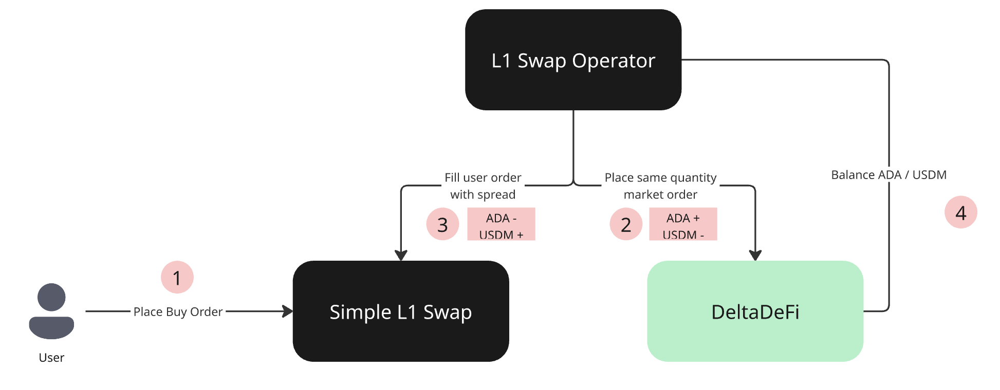

# Create Account

Signing in is as simple as just connecting your wallet. Choose your preferred wallet and sign a message to prove your wallet ownership to sign in.

<figure><figcaption></figcaption></figure>

If it is your first-time sign-in, you will be asked to define your trading password.&#x20;

<figure><figcaption></figcaption></figure>

After setting up your trading password, you can make deposit anytime.

<figure><figcaption></figcaption></figure>

***

### Related FAQ

* [Why do I have to create an account?](../../faq/product.md#i-have-to-create-account)
* [Why are only limited wallets supported in the web app?](../../faq/product.md#only-limited-wallets-are-supported-in-the-web-app)

