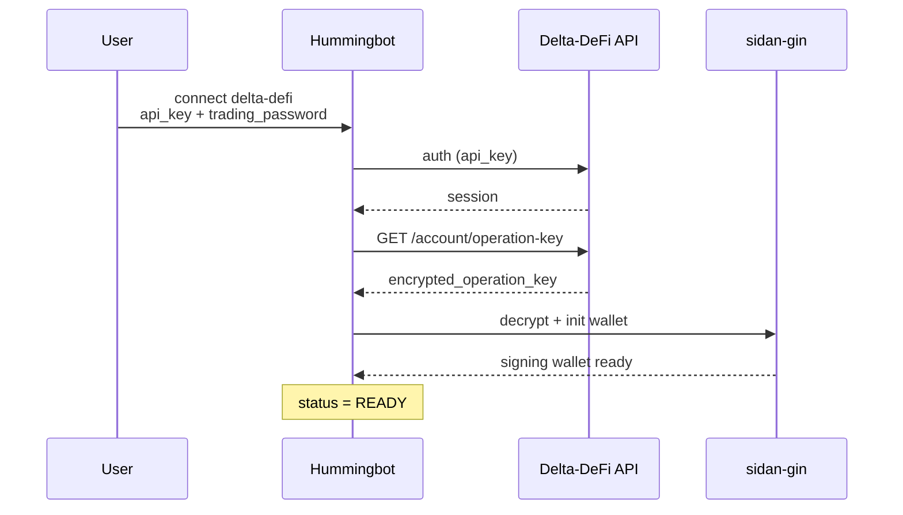

# Connecting to Delta-DeFi on hummingbot

With the fork installed and `sidan-gin` available in the `hummingbot` conda env, connect from the Hummingbot CLI:

```
>>> connect delta-defi
Enter your Delta-DeFi API key >>> <your_api_key>
Enter your Delta-DeFi trading password >>> <your_trading_password>
```

Verify:

```
>>> status
>>> balance
```

Delta-DeFi should appear with a green status indicator.

### Getting your API key

See [API Key / Dashboard](https://docs.deltadefi.io/start-trading/getting-started/api-key-dashboard) for how to generate an API key and set your trading password on the Delta-DeFi platform.

### Trading password

Enter the **same trading password** you used when generating the API key. This password is used to:

1. Authenticate with the Delta-DeFi platform
2. Decrypt the encrypted operation key returned by the API — the decrypted key is then handed to `sidan-gin` to initialize your signing wallet

### What happens behind the scenes



Related API references:

* [Auth](https://docs.deltadefi.io/start-trading/developers/auth)
* [Operation Key](https://docs.deltadefi.io/start-trading/developers/api-documentation/account/operation-key)
