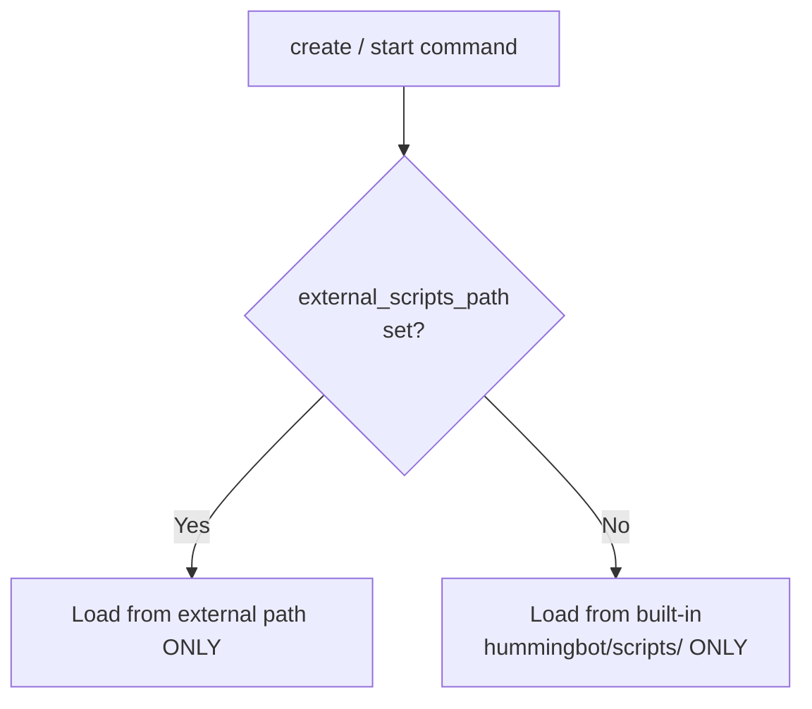

# External Scripts Path (optional)

This fork adds the ability to load V2 strategy scripts from **any directory on disk**, not just the built-in `hummingbot/scripts/` folder. This is useful when strategies are maintained in a separate repository.

### Default behavior

If you do nothing, Hummingbot loads scripts from `hummingbot/scripts/` — exactly like upstream. The `external_scripts_path` feature is fully opt-in.

### Enabling an external directory

From the Hummingbot CLI:

```
>>> config external_scripts_path /absolute/path/to/your/scripts
```

From this point on, Hummingbot loads scripts **only** from that path.

### Lookup behavior




The switch is **exclusive**. When `external_scripts_path` is set, the built-in `scripts/` folder becomes inaccessible. You cannot use both simultaneously.

To revert to the built-in folder, unset the path:

```
>>> config external_scripts_path
```

(Leave the value blank.)


### When to use this

* Strategy scripts are maintained in a separate git repo and you don't want to copy them into the fork.
* You want `git status` inside the hummingbot fork to stay clean while iterating on strategies.
