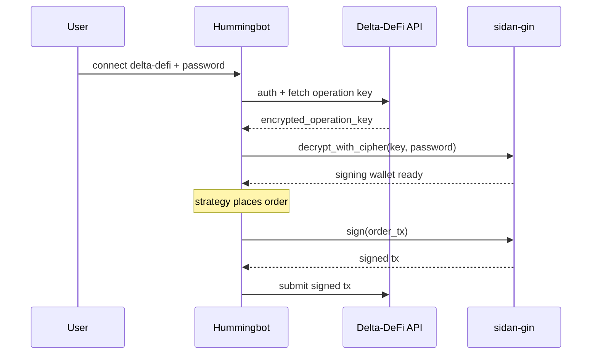

# Installing sidan-gin

It provides general Cardano primitives — wallets, signing, and cipher decryption — and is published independently so any Python project targeting Cardano can reuse it.

Because Hummingbot is Python-based, this fork uses `sidan-gin` to sign the Cardano transactions that submit orders to Delta-DeFi.

* **Repository:** [https://github.com/sidan-lab/gin](https://github.com/sidan-lab/gin)
* **Distribution:** pip (PyPI)
* **Scope:** not Hummingbot-specific — reusable by any Cardano Python project

### What the connector uses it for

1. Decrypting the **operation key** returned by the Delta-DeFi API
2. Initializing a Cardano signing wallet from the decrypted key
3. Signing every order transaction before submission to Delta-DeFi

Without `sidan-gin`, the connector authenticates and streams market data — but **every order silently fails** because no transaction can be signed.

### Signing flow



For the API-side contract of the encrypted key, see [Operation Key](https://docs.deltadefi.io/start-trading/developers/api-documentation/account/operation-key).

### Install

`sidan-gin` must be installed **inside the activated `hummingbot` conda environment**:

```bash
conda activate hummingbot
pip install sidan-gin
```


If you run `pip install sidan-gin` **without** activating the `hummingbot` conda env first, pip installs it into your base Python. Hummingbot still won't find it — even though `pip install` reports success.

Check with `which python` — the path should be inside the `hummingbot` env, for example:

```
/opt/miniconda3/envs/hummingbot/bin/python
```


### Verify

```bash
conda activate hummingbot
python -c "from sidan_gin import Wallet, decrypt_with_cipher; print('sidan-gin OK')"
```

Expected output:

```
sidan-gin OK
```

A `ModuleNotFoundError` means the package is not in the active environment — re-check the step above.

### What you'll see if it's missing

On startup, the connector logs:

```
sidan-gin package not available. Transaction signing will not be available.
Install with: pip install sidan-gin
```

`status` will still show the connector as green — but every `buy`, `sell`, or strategy-placed order will be rejected at the signing step.
