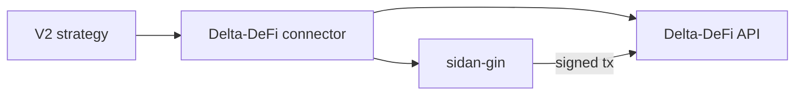

# Overview

### What's included

The fork extends upstream Hummingbot with:

* A **Delta-DeFi exchange connector** covering spot trading, order book streaming, user account streams, health monitoring, and risk guards.
* A **custom script loader** that lets you point Hummingbot at any external directory of V2 strategy scripts — useful when strategies are maintained in a separate repository.

### How order submission works

Delta-DeFi settles trades on Cardano, so every order submission is a signed Cardano transaction. The connector delegates signing to [`sidan-gin`](https://github.com/sidan-lab/gin) — an open-source Python library maintained by the Delta-DeFi team for Cardano development.

`sidan-gin` is a general-purpose Cardano Python library — it's not Hummingbot-specific. It's installed separately via pip. See [Installing sidan-gin](installing-sidan-gin.md) for why this step is required and easy to miss.

